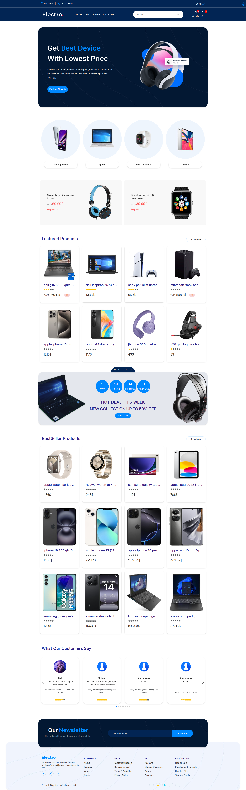

# Electronic Store

**Electronic Store** is a **Full Stack** graduation project from **DEPI**, built with **React.js** and **Node.js**.  
It provides a complete e-commerce shopping experience with both user-facing and admin dashboard functionalities.

## Features

### For User

- User Authentication – Registration & Login
- Browse Products – View products by categories and brands
- Add to Cart – Manage shopping cart items
- Add to Wishlist – Save favorite products
- User Profile – View and edit personal information
- Password Reset – Reset forgotten password
- Cash on Delivery – Place orders with COD payment method
- Product Reviews & Ratings – Review and rate purchased products
- Dark Mode – Switch between light and dark themes

### Admin Dashboard

- Dashboard Overview – View sales, orders, and statistics
- Product Management – Add, edit, and delete products
- Category Management – Add, edit, and delete categories
- Brand Management – Add, edit, and delete brands
- Order Management – Track and update order status
- User Management – Manage registered users

## Tech Stack

### Frontend

- React.js
- React Router
- Axios
- Redux Toolkit / Context API
- Tailwind CSS / Bootstrap
- Dark Mode Support

### Backend

- Node.js
- Express.js
- MongoDB + Mongoose
